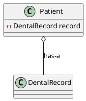
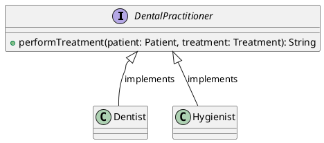
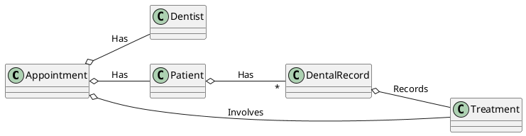
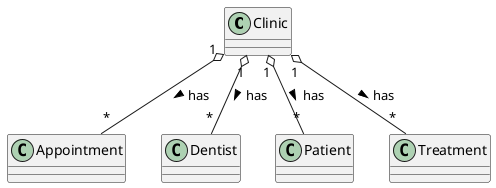
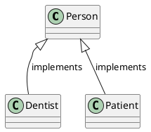

---
# try also 'default' to start simple
theme: default
background: dentist.jpeg
# apply any windi css classes to the current slide
class: 'text-center'
# https://sli.dev/custom/highlighters.html
highlighter: prism
canvasWidth: 800
# show line numbers in code blocks
lineNumbers: true

# persist drawings in exports and build
drawings:
  persist: false
# page transition
transition: slide-up
# use UnoCSS
css: unocss
---

# Object Oriented Programming with Kotlin and Spring Boot

Bite size kotlin session 4

<div class="pt-12">
    Elena van Engelen - Maslova
</div>

<div class="abs-br m-6 flex gap-2">
  <button @click="$slidev.nav.openInEditor()" title="Open in Editor" class="text-xl slidev-icon-btn opacity-50 !border-none !hover:text-white">
    <carbon:edit />
  </button>
  <a href="https://github.com/elenavanengelenmaslova/kotlin-fundamental-building-blocks" target="_blank" alt="GitHub"
    class="text-xl slidev-icon-btn opacity-50 !border-none !hover:text-white">
    <carbon-logo-github />
  </a>
</div>

<!--
The last comment block of each slide will be treated as slide notes. It will be visible and editable in Presenter Mode along with the slide. [Read more in the docs](https://sli.dev/guide/syntax.html#notes)
-->

---
transition: slide-up
---

## Format

Accelerate your programming skills by mastering the Object Oriented Programming while creating a Spring Boot REST API application for a Dental Clinic.️️

<v-clicks>

- 📘 **Master Object-Oriented Programming (OOP)** - Explore the fundamental elements of OOP in Kotlin.

- 🌱 **Apply OOP Principles with Spring Boot** - Solidify your grasp of OOP by integrating its concepts into a 'Dentist Clinic' Spring Boot application.

- 🌐 **Craft a REST API** - Illuminate and test your application through a RESTful interface, leveraging Swagger and unit tests.

- 🎒 **Take-Home Assignments** - Undertake practical coding challenges to enhance your application's range and depth.
  
</v-clicks>

<style>
h1 {
  background-color: #2B90B6;
  background-image: linear-gradient(45deg, #4EC5D4 10%, #146b8c 20%);
  background-size: 100%;
  -webkit-background-clip: text;
  -moz-background-clip: text;
  -webkit-text-fill-color: transparent;
  -moz-text-fill-color: transparent;
}
</style>

<!--
Here is another comment.
-->

---
layout: default
---

# Table of contents

<Toc minDepth="2" maxDepth="2"></Toc>

---
transition: slide-up
level: 2
---

# What is Spring boot?

<v-clicks>

- **Open-Source Micro Web Framework**: Streamlines creation of production ready web applications.

- **Stand-Alone & Production-Ready**: Build and run robust apps without external servers.

- **Spring-Based**: Builds upon the Spring framework, utilizing its Inversion of Control (IoC) and integration with various data sources, cloud, security mechanisms, and other tools.

- **Simplified Development**: Provides auto-configurations and built-in features for a streamlined development experience.

- **Cloud-Ready**: Designed for modern cloud deployments and scalability.

</v-clicks>

---
transition: slide-up
level: 3
---

# Why Spring Boot?

<v-clicks>

- Auto Configuration: Reduces the need for specifying beans in the configuration file.

- Standalone: No need for an external server. It has an embedded Tomcat, Jetty, or Undertow.

- Production Ready: Built-in features like health checks and metrics

</v-clicks>

---
transition: slide-up
level: 3
---

# Relation to Object-Oriented Programming (OOP):

<v-clicks>

- **Framework Structure**: Spring Boot, like most frameworks, is built on OOP principles. Its design patterns, components, and configurations are all rooted in OOP concepts.

- **Beans and Components**: At the core of Spring are "beans"—objects managed by the Spring container. Understanding object creation, lifecycle, and interactions is vital.

- **Clear Abstraction & Polymorphism**: Services, Controllers, Repositories in Spring Boot make heavy use of inheritance and polymorphism.

- **Why Learn OOP**: Grasping OOP is key to understanding how components in Spring Boot interact.

</v-clicks>

---
transition: slide-up
layout: section
level: 2
---

# Classes and objects, Data classes, Enum classes


---
transition: slide-up

level: 3
---

# Class relationships
Two main types of relationships, "has-a" or composition and "is-a" or inheritance.

### "Has-a" Relationships (Composition)
Example: A `Patient` class **has a** `DentalRecord`.



---

### "Has-a" Relationships (Composition) types

<v-clicks>

- One-to-one: One instance relates to exactly one other instance.

- One-to-many: One instance relates to multiple other instances.

- Many-to-many: Multiple instances relate to multiple other instances.

- Bidirectional: Mutual association.

</v-clicks>

---

### "Is-a" Relationships (Inheritance)
Inheritance illustrates the "Is-a" relationship. In our Dental Clinic:
- A `Dentist` **is a** `DentalPractitioner`.
- A `Hygienist` **is a** `DentalPractitioner`.




---

### "Is-a" Relationships (Inheritance) types

<v-clicks>

- Single Inheritance: A class inherits from a single superclass.

- Multiple Interface Inheritance: A class implements multiple interfaces.

- Overriding: A subclass provides a specific implementation for a method that is already defined in its superclass.

- Super: A subclass refers to its direct superclass.

</v-clicks>

---
class: flex flex-col justify-center items-center h-[100vh] space-y-4
---

https://qrco.de/be1p4R


---
transition: slide-up

level: 3
---
# Basic object model





---
transition: slide-up

level: 3
---

# Data classes

### Immutability in Data Classes

<v-clicks>

- Safety and Predictability: Once a variable is set, it can't be changed, leading to more reliable code.

- Kotlin's Embrace of Immutability: Variables declared with val in data classes can't be reassigned.

- Usage of copy(): To change some properties while keeping others the same.

- Spring Boot Aspect:
  - In REST APIs, immutable DTOs ensure data consistency across multiple concurrent requests.

</v-clicks>

---
transition: slide-up

level: 3
---

# Example DTO

```kotlin {all|1-6|8-11}
data class AppointmentRequest(
    val patientId: String,
    val dentalPractitionerId: String,
    val dateTime: LocalDateTime,
    val treatmentId: String,
)

data class AppointmentResponse(
    val id: String? = null,
    val message: String,
)
```

---
transition: slide-up

level: 3
---

# Serialization of Data Classes

<v-clicks>

- Transforming Data: Convert objects to formats like JSON for storage or transmission.

- Auto Serialization: Kotlin data classes are naturally suited for serialization due to their simplicity.

- Kotlin's kotlinx.serialization: Provides native serialization capabilities.

- Spring Boot Aspect:
  - Uses the Jackson library by default for JSON serialization, seamlessly working with Kotlin data classes. 
  - Data classes can be easily used as request and response bodies in Spring Boot's REST controllers.

</v-clicks>

---
transition: slide-up

level: 3
---

# Example DTO usage

```kotlin {all|3,4}
@PostMapping
fun scheduleAppointment(
    @Valid @RequestBody appointmentRequest: AppointmentRequest,
): ResponseEntity<AppointmentResponse> {
    // ...
}
```

---
transition: slide-up
layout: section
level: 3
---

# 💻 Identify which classes could be data classes and update the app!

---
transition: slide-up

level: 3
---


# Enums

### Enum Constants

<v-clicks>

- Represent unique, unmodifiable instances of the enum class.

- Accessible directly through the enum class, e.g., `TreatmentType.CHECKUP`.

- Useful for fixed sets of values

- Enums inherently follow the Singleton design pattern

</v-clicks>

---
transition: slide-up

level: 3
---

# Properties and Methods in Enum Classes

<v-clicks>

- Enums can have properties, methods, and implement interfaces.

```kotlin {all|1-5}
enum class TreatmentType(
    val displayName: String,
    val duration: Duration,
) {
    CHECK_UP("Check-up", Duration.ofMinutes(30)),
    CLEANING("Cleaning", Duration.ofMinutes(60)),
    TOOTH_EXTRACTION("Tooth Extraction", Duration.ofMinutes(90)),
    FILLING("Filling", Duration.ofMinutes(120)),
    ROOT_CANAL("Root Canal", Duration.ofMinutes(120));
}

```
</v-clicks>

---
transition: slide-up

level: 3
---

# Abstract Methods in Enum Classes

<v-clicks>

- Allows for different behavior across enum constants.
- Each constant provides its own implementation.
- A strategy pattern in practice, choosing algorithms at runtime

```kotlin {all|2-6}
enum class TreatmentType(val displayName: String) {
    CHECK_UP("Check-up") {
        override fun getDuration() = Duration.ofMinutes(30)
    },
    // the rest of the enums
    abstract fun getDuration(): Duration
}

```
</v-clicks>

---
transition: slide-up
layout: section
level: 3
---

# 💻 Hands-on: add enum

---
transition: slide-up

level: 2
---
# Object keyword

Object keyword in Kotlin serves multiple purposes: singletons, companion objects, and object expressions. Allows declaration and instantiation of a class simultaneously.

<v-clicks>

### Singleton Pattern with object

- Ensures a class has only one instance.
- Useful for system-wide actions, especially in multi-threaded scenarios.

```kotlin {all}
object Clinic {
    val patients = mutableMapOf<String, Patient>()
    val dentists = mutableMapOf<String, Dentist>()
    val treatments = mutableMapOf<String, Treatment>()
    val appointments = mutableListOf<Appointment>()
    // the rest of the object
}

```
</v-clicks>

---
transition: slide-up

level: 3
---
### Companion Objects

<v-clicks>

- Functions, properties and constants can be defined on a class level using companion objects.

- Useful for defining class level constants, factory methods, and functionality related to a class.


```kotlin {all|4-8}
data class Treatment(val id: String, val name: String, val type: TreatmentType) {
    // the rest of the instance members
    companion object {
        fun teethCleaning() = Treatment(
            "T001",
            "Teeth Cleaning",
            TreatmentType.CLEANING
        )
        // other factory methods 
    }
}
```

</v-clicks>

---
transition: slide-up

level: 3
---

# Object Expressions

<v-clicks>

- Enables concise class definition and instantiation in a single expression.

- Typically used for listeners or one-time-use scenarios.

```kotlin
val appointmentListener = object : AppointmentListener {
    override fun onAppointmentScheduled(appointment: Appointment) {
        // handle the event
    }
}

```

</v-clicks>

---
transition: slide-up
layout: section
level: 3
---

# 💻 Hands-on: use object keyword

---
transition: slide-up
layout: section
level: 2
---
# Inheritance, Interfaces and Polymorphism

---
transition: slide-up

level: 3
---
# Inheritance
Allows creation of a new class based on an existing one. Aims at code reusability and maintainability.

<v-clicks>

### Terminology

- Superclass (Parent): Class being extended (e.g., `Person`).
- Subclass (Child): Class that inherits from another (e.g., `Dentist`, `Patient`).



</v-clicks>

---
transition: slide-up

level: 3
---
### Open and override keywords

- Classes are final by default in Kotlin. 
- Use `open` to allow inheritance. 
- Use `override` keyword to customize inherited methods/properties.

```kotlin {all|5,12}
open class Person(
    open val id: String,
    open val name: String,
) {
    open fun introduce() = "Hello, my name is $name."
}
class Dentist(
    id: String,
    name: String,
) : Person(id, name) {

    override fun introduce() = "${super.introduce()} I'm a dentist."
}

```

---
transition: slide-up

level: 3
---
### Super Keyword

- References the immediate superclass.
- Useful for retaining superclass functionality while adding subclass-specific behavior.

```kotlin
 override fun introduce() = "${super.introduce()} I'm a patient."
```

---
transition: slide-up

level: 3
---
### Constructors in Inheritance

- Superclass constructor called first.
- Ensures superclass properties are initialized prior to subclass.

```kotlin
class Patient(
    id: String,
    name: String,
) : Person(id, name) {
    var insurance: String? = null
    // The rest of the Patient class initialisation
    constructor(id: String, name: String, insurance: String)
            : this(id, name) {
        println("Secondary constructor called. Insurance: $insurance")
        this.insurance = insurance
    }
    // The rest of the Patient class
}

```

---
transition: slide-up
layout: section
level: 3
---

# 💻 Hands-on: add inheritance

---
transition: slide-up

level: 3
---
# Interfaces

---
transition: slide-up

level: 3
---
# Polymorphism


---
transition: slide-up

level: 2
---
# Generics


---
level: 2
---
# Sealed classes and Value classes

---
level: 2
---
# Smart casts and Destructuring declarations

---
level: 2
---
# Annotations

---
level: 2
---
# Conclusion 

---
layout: end
---

