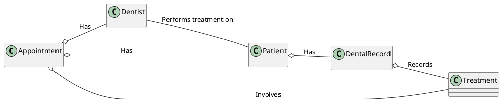
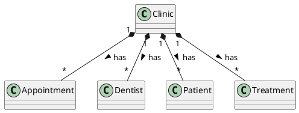

---
# try also 'default' to start simple
theme: default
background: dentist.jpeg
# apply any windi css classes to the current slide
class: 'text-center'
# https://sli.dev/custom/highlighters.html
highlighter: prism
canvasWidth: 800
# show line numbers in code blocks
lineNumbers: true

# persist drawings in exports and build
drawings:
  persist: false
# page transition
transition: slide-up
# use UnoCSS
css: unocss
---

# Object Oriented Programming with Kotlin and Spring Boot

Bite size kotlin session 4

    Elena van Engelen - Maslova

  <button @click="$slidev.nav.openInEditor()" title="Open in Editor" class="text-xl slidev-icon-btn opacity-50 !border-none !hover:text-white">
    <carbon:edit />
  </button>
  <a href="https://github.com/elenavanengelenmaslova/kotlin-fundamental-building-blocks" target="_blank" alt="GitHub"
    class="text-xl slidev-icon-btn opacity-50 !border-none !hover:text-white">
    <carbon-logo-github />
  </a>

<!--
The last comment block of each slide will be treated as slide notes. It will be visible and editable in Presenter Mode along with the slide. [Read more in the docs](https://sli.dev/guide/syntax.html#notes)
-->

---
transition: slide-up
---

## Format

Accelerate your programming skills by mastering the Object Oriented Programming while creating a Spring Boot REST API application for a Dental Clinic.️️

<v-clicks>

- 📘 **Master Object-Oriented Programming (OOP)** - Explore the fundamental elements of OOP in Kotlin.

- 💻 **Apply OOP Principles with Spring Boot** - Solidify your grasp of OOP by integrating its concepts into a 'Dentist Clinic' Spring Boot application.

- 🏁 **Craft a REST API** - Illuminate and test your application through a RESTful interface, leveraging Swagger and unit tests.

- 🎒 **Engaging Take-Home Assignments** - Undertake practical coding challenges to enhance your application's range and depth.

</v-clicks>

<!--
Here is another comment.
-->

---
layout: default
---

# Table of contents

<Toc minDepth="2" maxDepth="3"></Toc>

---
transition: slide-up

level: 2
---

# Classes, Objects and Data classes

Basic object model

---
transition: slide-up

level: 2
---
# Enum classes

---
transition: slide-up

level: 2
---
# Inheritance and Interfaces

---
transition: slide-up

level: 2
---
# Polymorphism

---
level: 2
---
# Generics

---
level: 2
---
# Sealed classes

---
level: 2
---
# Value classes

---
level: 2
---
# Object keyword

---
level: 2
---
# Smart casts

---
level: 2
---
# Annotations

---
level: 2
---
# Restructuring declarations

---
level: 2
---
# Conclusion 

---
layout: end
---

